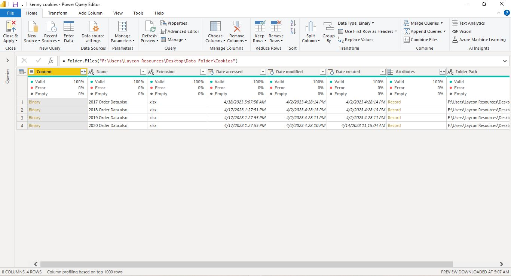
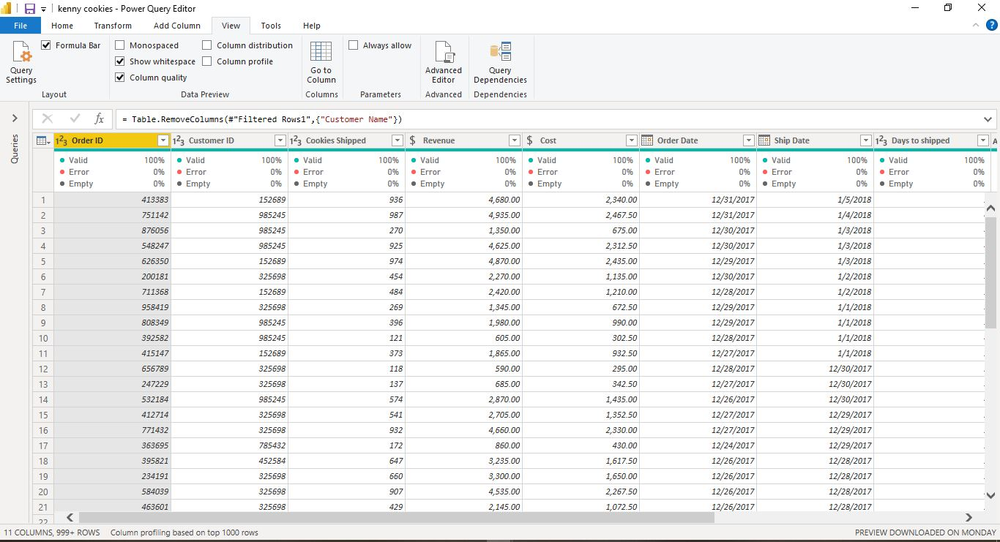
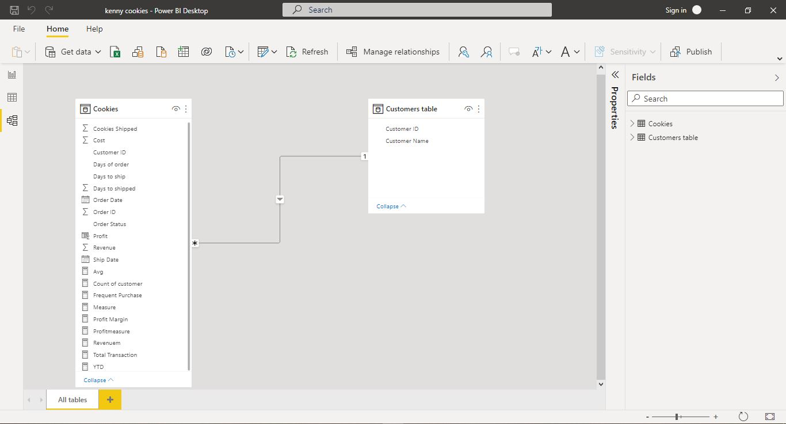
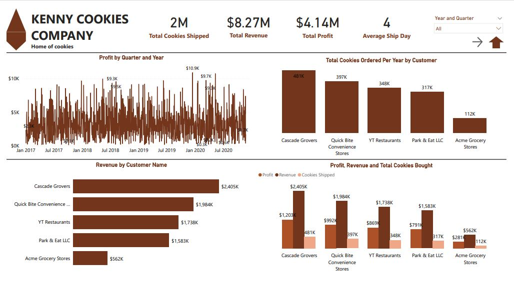
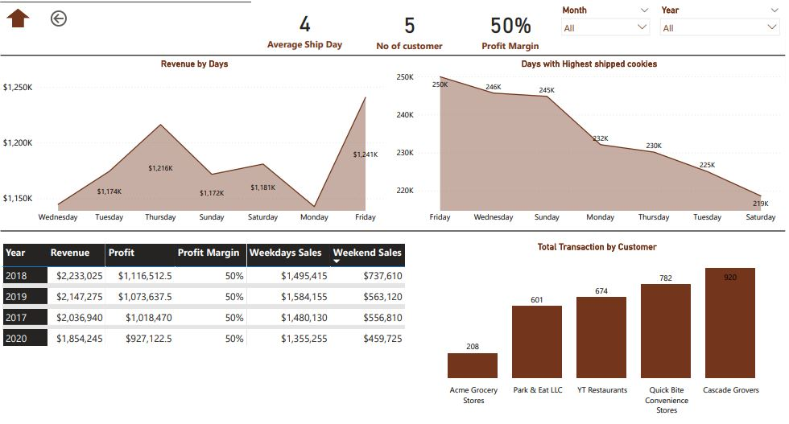

-----

# Introduction
This data was gotten from Kelvin YouTube Channel. And it contains four (4) excel sheets. Power BI was used to clean, analyze and visualize the report. The datasets all together are 9 fields and 3k+ records 

***Disclaimer***: *The company 'Kenny Cookies Company' is an imaginary and do not in anyway relates to an actual company.*

# Data Cleaning 
The dataset contains messy data and all year orders from 2017 - 2020 were entered on a separate workbook which makes it four (4) datasets. In order to merge all four datasets together and to allow Power BI automate the cleaning process, a folder was created and named Kenny Cookies and two of the datasets 2017 and 2018 were moved into the folder, and the data was upload into Power BI by using get data from folder. The only disadvantage with these is that the data must have the same structure. After the cleaning, 2019 and 2020 datasets was added and the data refreshed and the datasets was cleaned automatically. 

### Cleaning of some column
- company ID and company Name were typed together and needs to be splited. For the Company ID and Company Name to be on a separate column, split by delimiter (space) was used to split the data. The data type were changed to their appropriate data type
- date data type for order date and ship date
- Revenue and cost to currency 
- creating of profit column by subtraction revenue from cost and data type currency. 
- days to ship column was added by substrating ship date from order date.
- days of the week was created for both ship date and order date

After the cleaning, the dataset has 13 fields and 3k+ columns

| All Orders Table     | All Orders Table Merged | All Orders Table Cleaned     | 
|-----------------:|:------------------:|:-------------------|
||  |  |

# Data Modeling 
The dataset consist of one fact table i.e the order table. From the fact table, a dimension table was extracted onto a separate table. 
The fact table consist of 
- OrderId
- CustomerId
- Cookies Shipped 
- Order date
- Ship date 
- Revenue
- Cost 
- Profit
- Days to ship
- Days of order 
- Days of ship

The dimension table consist of 
- CustomerId
- Customer Name 

This was done to test my data modeling skils

# Skills Showcased
- Data modeling
- Calculated Column 
- Measure
- DAX
- Navigation Page 
- Tool Tips 

# Business Questions
The following questions were answered 
- What is the total cookies shipped? 
- What is total revenue generated?
- Find the Profit generated?
- What is the Average shipped day and if the average ship day is greater or equal to 4, give recommendation on what to do to reduce the time for shipment. 
- Show the revenue by customer 
- What is the total number of cookies ordered per year 
- In a single chart, show the Profit, Revenue and total number of cookies shipped for each customers.
- How many customers does the company have? 
- What is the profit margin for each year? 
- Show the Revenue generated by each days of the week.
- Which day of the week has the highest shipment for each year 
- Which customer has the most order and which customer has the highest purchase?
- In a single visual,show Revenue, Profit, Profit margin, weekdays sales and weekend sales for each year.

## Answer to business question

# General Summary
Total Revenue generated from January 2017 to 2020 is $8.27 million and the Total profit is $4.14 million. From 2017 - 2020, 2 million cookies has been shipped to our customers. And the customer with the highest purchase are Cascade Grovers followed by Quick Bite. Though, all customers are valuable because they bring money to the table, regardles of how small but our most valuable customers are these two mentioned out of our five (5) customers. 

The profit margin from 2017 - 2020 is 50%, weekdays sales are $1,495,415, $1,584,155, $1480,130 and $1,355,255 and weekend sales are $737,610, $563,120, $556,810 and $459,725 from 2017 to 2020 respectively. 

At $1,240,545, Friday had the highest Revenue and was 8.55% higher than Monday, which had the lowest Revenue at $1,142,840. Friday accounted for 15.00% of Revenue. Across all 7 Days of order, Revenue ranged from $1,142,840 to $1,240,545.

At 249984, Friday had the highest Cookies Shipped and was 3,083.29% higher than, which had the lowest Cookies Shipped at 7853. Friday accounted for 15.11% of Cookies Shipped. Across all 8 Days to ship, Cookies Shipped ranged from 7853 to 249984.

The average ship day of cookies is (4) four. 

# Recommendation
According to the data analyzed, it took some cookies 6 days to be shipped out of the factory and the average shipped day is (4) four. 

To gain further insights as to my cookies are shipped late out of the factory, further analysis was carried out to determine if the quantity of cookies to be shipped causes the delay shipment and found out that it doesn't. 

The factory manager and other stakeholders should look into this as the time taken to shipped out cookies is late. 

# Thank you

